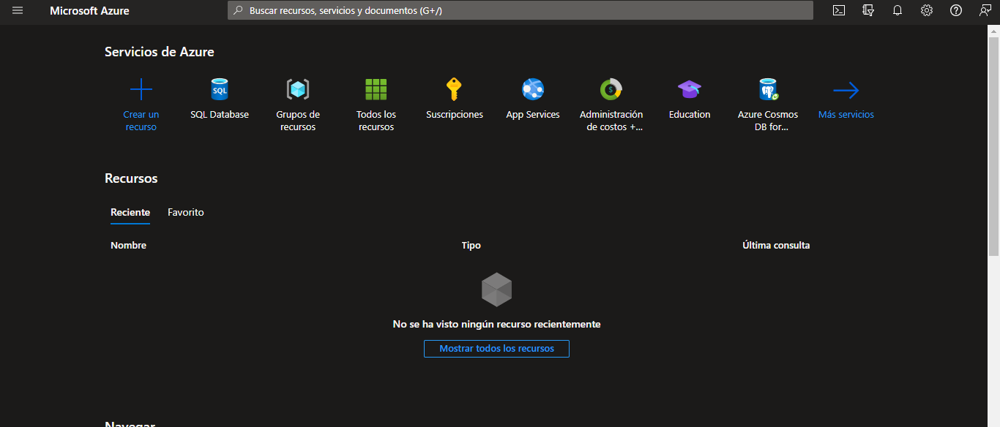

# Azure_SQLServer

En este repositorio, encontrarás una guía detallada sobre los siguientes temas:

- **Creación de una base de datos en Microsoft Azure** utilizando el sistema de gestión de bases de datos Microsoft SQL Server.
- **Establecimiento de una conexión con 'SQL Server Management Studio'.**
- **Conexión a la base de datos** mediante el lenguaje de programación Java.
- **Conexión a la base de datos** mediante el lenguaje de programación C#.

## Primeros pasos

1. Para comenzar, ingresa al [Portal de Azure](https://portal.azure.com/). Esta URL es crucial ya que te permitirá administrar los servicios de Azure. **https://portal.azure.com/**
2. Asegúrate de usar las credenciales de tu cuenta de organización, educativa o personal que cuente con una suscripción en Azure.
3. Una vez ingresado a nuestra cuenta, visualizar la pantalla de inicio del [Portal de Azure](https://portal.azure.com/)

